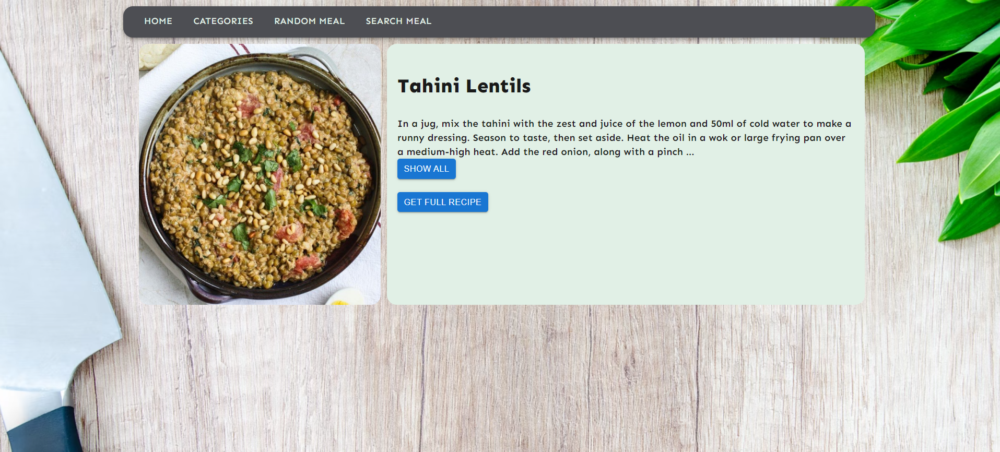
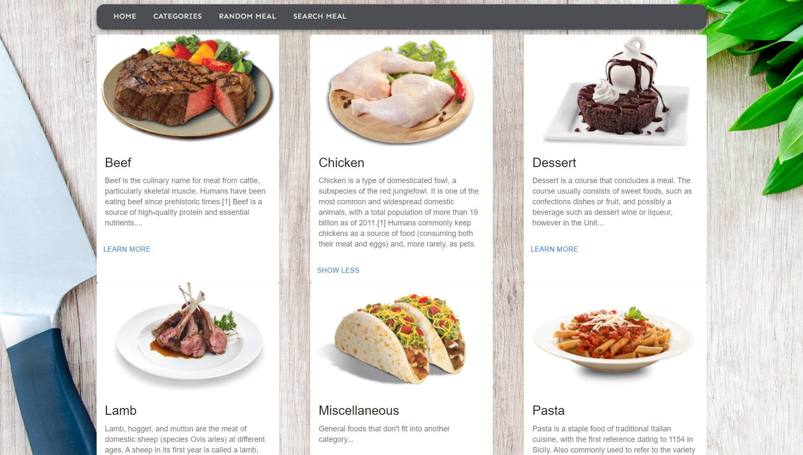
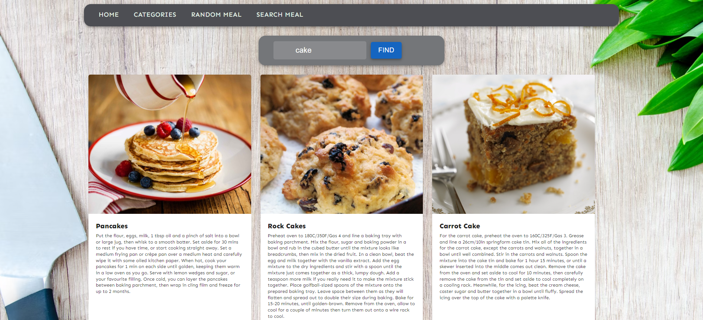

# 🍲 What meal to cook today? 
Meal recipe generator application (SSR + API).

# 🍔 Random meal
When you click the "Generate meal" button on a Home page API generates a random meal recipe. So you can checkout out the full description and read the full text recipe by clicking "Get full recipe".

# 🧑🏼‍🍳 Meal categories
You can also check out different categories of meals:

# 🥕 Find a meal by its name or ingredient!
If you would like to find all meal by any ingredient or you know the exact name of the meal you can use a search input.
Type in a meal's name or ingredient and you'll get all meals which contain your request.

## 📝 License

This project is licensed under the Copyright © 2024 Ivan Ivanov.
